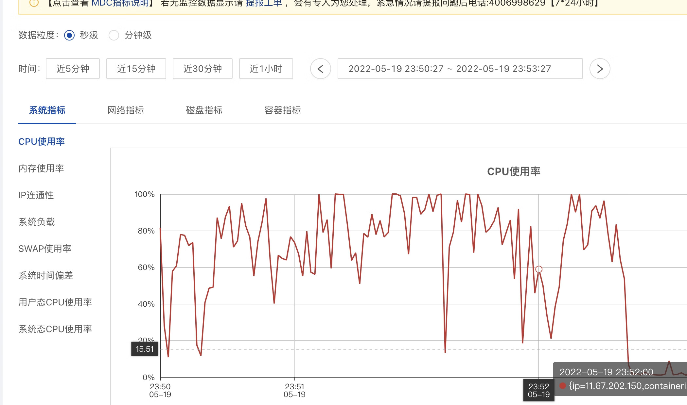
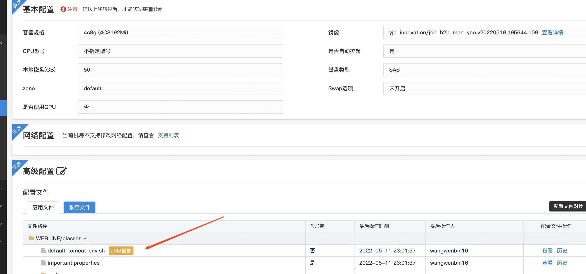

# 类加载机制


java文件通过javac编译成class文件，这种中间码称之为字节码。 

然后由jvm加载字节码，通过解释器解释为一行行代码，执行期间编译器会把热点代码及时编译成机器码以获得更高的执行效率。

解释器是封装好的不需要我们去做任何处理，平常业务中涉及到的动态代理也就只是在类加载器中执行，就是java到class这个阶段进行的


类加载阶段包括：加载、连接、初始化

类加载和加载的区别：加载只是类加载的第一阶段

**解析部分**是灵活的，它可以在初始化完成之后进行，实现所谓的“后期绑定”，其他环节的顺序是不可以改变的

## 加载

加载是一个读取class文件，将其转化为某种静态数据存储在方法区内，并在堆中生成一个便于用户调用的java.lang.Class类型的对象的过程。


动态代理就是使用及时计算出来的class然后实例化代理对象。

我们可以自由选定二进制流的来源，这也是jvm开放出来我们可以唯一修改的地方 

## 连接-验证


对文件格式的检验其实是发生在加载阶段的，此时方法区虽然已经存在了该class的静态结构，堆中也存在了该class类型的对象，但是这并不代表着jvm已经完全认可了这个类，如果程序想使用这个类那么就必须进行连接，而连接的第一步就是对这个类进行验证（验证元数据、字节码），简单概括来说就是对class静态结构进行语法和语义上的分析保证其不会对虚拟机造成危害，如果这两个验证通过那么虚拟机会姑且认为该class是安全的，但是这并不意味着验证已经完全结束了，还有一道对符号引用进行验证的步骤，它是在解析阶段进行的。 

验证环节会随着虚拟机的不断迭代还会引入更多完善更完善的策略。


## 连接-准备


准备环节就是为该类型中定义的静态变量赋初始值，这里仅仅是静态变量，而不是成员变量

虚拟机内存规范中定义了方法区这种抽象概念，HotSpot这种主流虚拟机在JDK8之前，使用了永久代这种具体的方式来实现方法区，在JDK8以后，弃用了“永久代”这种实现方式，采用了元空间这种直接内存取代


## 连接-解析


这个阶段就是将符号引用替换为直接引用。

当一个Java类被编译成class之后，假如这个类称为A，并且A中引用了B，那么在编译阶段，A是不知道B有没有被编译，而且此时B也一定没有被加载，所以A肯定不知道B的实际地址，那么A怎么才能找到B呢，此时在A的class文件中，将使用一个字符串S来代表B的地址，S就被成为符号引用，在运行时，如果A发生了类加载，到解析阶段会发现B还未被加载，那么会触发B的类加载，将B加载到虚拟机中，此时A中B的符号引用将会被替换为B的实际地址，这被成为直接引用。也是上图所示的静态解析。

在java中我们常常会使用多态，在多态中我们不知道具体的实现类，直到运行的过程中发生了调用，此时虚拟机调用栈中将会得到具体的类型信息， 这时候再进行解析就能用明确的直接引用来替换符号引用了，这也是解析阶段为什么有时发生在初始化机端之后，这就是动态解析，用它来实现后期绑定，底层对应了invokedynamic这条字节码指令


## 初始化


此阶段会判断代码中是否存在**主动的资源初始化操作**（不是指构造函数，而是class层面的，比如说成员变量的赋值，静态变量的赋值，以及静态代码块的逻辑，而只有显示的调用new指令才会调用构造函数，进行对象的实例化，这是对象层面的）


只有加载步骤中的读取二进制流与初始化部分，能够被上层开发者也就是Java程序员控制，而剩下的所以步骤，都是由JVM掌控，其中细节由JVM的开发人员处理，对上层开发者来说是个黑盒


# 类加载器


## 分类

JVM加载器分为两大类：启动类加载器、非启动类加载器

Bootstrap ClassLoader：嵌套在JVM内部，无法作为对象被程序引用，主要用来加载Java的核心类库，比如说<JAVA_HOME>/lib 下的jar包或指定路劲下的核心类库，为了安全起见，只加载包名在白名单下的文件比如说Java.下的包（除此之外都是使用Java进行编写的，此加载器使用的是C ）

Extension ClassLoader（扩展类加载器 ）：主要加载<JAVA_HOME>/lib/ext目录下 或由系统变量指定下的类库

Application ClassLoader（启动类加载器）：用于加载环境变量class path或者是系统属性指定路径下的类库，希望加载的是程序员开发的代码和一些三方类库

User ClassLoader：以上三种都只能从本地文件中获取字节码来进行加载，而User ClassLoader可以让用户获取到任何来源的字节码，并对他们进行加载

用户实现类加载器的方法：只需要继承Java.lang.ClassLoader然后单独实现获取二进制流的逻辑，而后续的步骤必须让java.lang.ClassLoader的内置逻辑处理 ，用户无权进行重写和干涉 


**问题：**

1. 我们可不可以用Extension ClassLoader加载我们自己写的代码呢？而不是用Application ClassLoader

可以，但是我们是不推荐这么做的，不符合规范，工程项目是讲究分层和抽象的，就像我们在写代码的时候可以把代码放到一个包下面，但是不推荐这么做

2. 不同的类加载器，除了读取二进制流的动作和范围不一样，后续的加载逻辑是否也不一样？

我们认为除了Bootstrap ClassLoader，所有非Bootstrap ClassLoader都继承了Java.lang.ClassLoader，都由这个类的defineClass进行后续的处理

3. 遇到限定名一样的类，这么多类加载器会不会混乱？

越核心的类库被越上层的类加载器加载，而某限定名的类一旦被加载过了，被动情况下，就不会再加载相同限定名的类。这样，就能够有效避免混乱


JVM规范：每个类加载器都有属于自己的命名空间

默认情况下，一个限定名的类只会被一个类加载器加载并解析使用，这样的程序中，他就是唯一的，不会产生歧义

## **双亲委派**


在被动的情况下，当一个类加载器收到加载请求，它不会首先自己去加载，而是传递给自己的父亲加载器，这样所有的类都会传递到上层的Bootstrap ClassLoader，只有父亲加载器无法加载，儿子加载器才会尝试自己加载，什们是无法加载呢，就是根据类的限定名，类加载器没有在自己负责的路径中找到该类，这里需要注意的是他们之间不是继承关系，是通过组合的方式实现的。以下是双亲委派的具体实现


## **破坏双亲委派的示例**

###  **第一次破会双亲委派**

这个是有一个历史原因的，因为双亲委派模型是JDK1.2以后才引用进来的，在1.1及以前用户实现自己的类加载器都是通过重写loadClass方法实现，为了兼容原来的实现方式，就选择了增加findClass这么一种妥协的方式。 


如果用户没有实现自定义的 findClass 方法，那只要是执行到了 findClass ，还是直接抛出异常，那这个方法看起来怪怪的，它有什么目的呢？

实现自定义类，源码可以复用上面重写loadClass的实现，只需要将loadClass方法为findClass方法即可。


### **第二次破坏双亲委派**


默认线程current Thread中的加载器为Application LoadClass加载器


### **第三次破坏双亲委派**

能够在程序运行时动态的对部分组件代码进行替换，会自由的设置类加载机制，比如：热部署


## 思考题

能不能自己写一个限定名为Java.lang.String的类，并在程序中调用它？

其他解释：https://blog.csdn.net/sky__fall/article/details/109698544

以下参考来源：https://blog.csdn.net/tang9140/article/details/42738433

网上提供的答案：通常不可以，但可以采取另类方法达到这个需求。所谓的另类方法指自己写个类加载器来加载java.lang.System达到目的。

首先表明下我的观点。上述答案完全是误导读者，是不正确的答案。我就纳闷了网上怎么把这种完全不正确的搜索结果排在前面，而且几乎搜到的都是这种不正确的答案。可能很多不明真相的朋友就这么被误导了，所以还是希望大家对网上的内容先持怀疑态度为好。下面详细说明为什么。

首先，摘抄网上错误答案的详细解释

“为了不让我们写System类，类加载采用委托机制，这样可以保证爸爸们优先，爸爸们能找到的类，儿子就没有机会加载。而System类是Bootstrap加载器加载的，就算自己重写，也总是使用Java系统提供的System，自己写的System类根本没有机会得到加载。
但是，我们可以自己定义一个类加载器来达到这个目的，为了避免双亲委托机制，这个类加载器也必须是特殊的。由于系统自带的三个类加载器都加载特定目录下的类，如果我们自己的类加载器放在一个特殊的目录，那么系统的加载器就无法加载，也就是最终还是由我们自己的加载器加载。”

然后，说明下上面解释中提到的一些概念

类加载器可分为两类：一是启动类加载器(Bootstrap ClassLoader)，是C++实现的，是JVM的一部分；另一种是其它的类加载器，是Java实现的，独立于JVM，全部都继承自抽象类java.lang.ClassLoader。jdk自带了三种类加载器，分别是启动类加载器（Bootstrap ClassLoader），扩展类加载器（Extension ClassLoader），应用程序类加载器（Application ClassLoader）。后两种加载器是继承自抽象类java.lang.ClassLoader。关于这三种加载器各自的作用这里不做详细说明，有兴趣的可以自己了解下。

类加载器是有层次的

一般是： 自定义类加载器  >> 应用程序类加载器  >> 扩展类加载器  >> 启动类加载器

上面的层次关系被称为双亲委派模型(Parents Delegation Model)。除了最顶层的启动类加载器外，其余的类加载器都有对应的父类加载器。

再简单说下双亲委托机制：如果一个类加载器收到了类加载的请求，它首先不会自己尝试去加载这个类，而是把这个请求委派给父类加载器，每一个层次的类加载器都是加此，因此所有的加载请求最终到达顶层的启动类加载器，只有当父类加载器反馈自己无法完成加载请求时（指它的搜索范围没有找到所需的类），子类加载器才会尝试自己去加载。

再回去看下解释内容，我相信前面的部分大家应该很看懂了，也没什么大问题。最后的如果部分“如果我们自己的类加载器放在一个特殊的目录，那么系统的加载器就无法加载，也就是最终还是由我们自己的加载器加载。” 我就不明白所以了，逻辑完全不通。我想它的本意可能是，将自己的java.lang.System类放置在特殊目录，然后系统自带的加载器无法加载，这样最终还是由我们自己的加载器加载（因为我们自己的加载器知道其所在的特殊目录）。这种说法好像逻辑上没有问题，那么我们就来实验下了。

代码验证

测试类结构及内容如下：


```java
public class MyClassLoader extends ClassLoader{
    
    public MyClassLoader() {
        super(null);
    }
    
    @Override
    public Class<?> loadClass(String name) throws ClassNotFoundException {
        try{
            String className = null;
            if(name.startsWith("java.lang")){
                className = "/" + name.replace('.', '/') + ".class";
            }else{
                className = name.substring(name.lastIndexOf('.') + 1) + ".class";
            }
            System.out.println(className);
            InputStream is = getClass().getResourceAsStream(className);
            System.out.println(is);
            if(is == null)
                return super.loadClass(name);
            
            byte[] b = new byte[is.available()];
            is.read(b);
            return defineClass(name, b, 0, b.length);
        }catch (Exception e) {
            e.printStackTrace();
            throw new ClassNotFoundException();
        }
    }
}
```


```java
public class ClassLoaderTest {
 
    public static void main(String[] args) throws ClassNotFoundException, InstantiationException, IllegalAccessException {
        ClassLoader myLoader = new MyClassLoader();
        Object obj = myLoader.loadClass("java.lang.Math").newInstance();
        System.out.println(obj);
    }
    
}
```


```java
public final class Math {
    
    public static void main(String[] args) {
        System.out.println("hello world");
    }
}
```


```java
public class MyMath {
    
    public static void main(String[] args) {
        System.out.println("hello world");
    }
}
```

上面的测试代码没用自定义java.lang.System类，因为测试代码用到了JDK自带的System类进行输出打印，会冲突，所以改用为自定义的java.lang.Math类。如果自定义的Math类能加载，那么自定义的System类同样能加载。

我们先直接运行下Math类，输出如下：

java.lang.NoSuchMethodError: main
Exception in thread "main" 

提示Math类没有main方法。首先大家要明白一个概念，当类首次主动使用时，必须进行类的加载，这部分工作是由类加载器来完成的。根据双亲委托原则，Math类首先由启动类加载器去尝试加载，很显然，它找到rt.jar中的java.lang.Math类并加载进内存（并不会加载我们自定义的Math类），然后执行main方法时，发现不存在该方法，所以报方法不存在错误。也就是说，默认情况下JVM不会加载我们自定义的Math类。

再直接运行MyMath类，输出如下：

**java.lang.SecurityException: Prohibited package name: java.lang**
**at java.lang.ClassLoader.preDefineClass(ClassLoader.java:479)**
at java.lang.ClassLoader.defineClassCond(ClassLoader.java:625)
at java.lang.ClassLoader.defineClass(ClassLoader.java:615)
at java.security.SecureClassLoader.defineClass(SecureClassLoader.java:141)
at java.net.URLClassLoader.defineClass(URLClassLoader.java:283)
at java.net.URLClassLoader.access$000(URLClassLoader.java:58)
at java.net.URLClassLoader$1.run(URLClassLoader.java:197)
at java.security.AccessController.doPrivileged(Native Method)
at java.net.URLClassLoader.findClass(URLClassLoader.java:190)
at java.lang.ClassLoader.loadClass(ClassLoader.java:306)
**at sun.misc.Launcher$AppClassLoader.loadClass(Launcher.java:301)**
at java.lang.ClassLoader.loadClass(ClassLoader.java:247)
Exception in thread "main" 

注意红色部分的内容。由堆栈异常信息可知道，当应用程序类加载器类（AppClassLoader）尝试加载MyMath类时，ClassLoader.java的479行抛出了SecurityException

禁止使用包名：java.lang。

直接查看抽象类java.lang.ClassLoader的preDefineClass方法代码，摘抄如下：

```java
    private ProtectionDomain preDefineClass(String name,
					    ProtectionDomain protectionDomain)
    {
	if (!checkName(name))
	    throw new NoClassDefFoundError("IllegalName: " + name);
 
	if ((name != null) && name.startsWith("java.")) {
	    throw new SecurityException("Prohibited package name: " +
					name.substring(0, name.lastIndexOf('.')));
	}
	if (protectionDomain == null) {
	    protectionDomain = getDefaultDomain();
	}
 
	if (name != null)
	    checkCerts(name, protectionDomain.getCodeSource());
 
	return protectionDomain;
    }
```

可以看到如果加载的类全名称以“java.”开头时，将会抛出SecurityException，这也是为什么直接执行MyMath类会出现SecurityException。

照这样，我们自定义的类加载器必须继承自ClassLoader，其loadClass()方法里调用了父类的defineClass()方法，并最终调到preDefineClass()方法，因此我们自定义的类加载器也是不能加载以“java.”开头的java类的。我们继续运行下ClassLoaderTest类，输出如下：

/java/lang/Math.class
sun.net.www.protocol.jar.JarURLConnection$JarURLInputStream@a981ca
java.lang.SecurityException: Prohibited package name: java.lang
**at java.lang.ClassLoader.preDefineClass(ClassLoader.java:479)**
at java.lang.ClassLoader.defineClassCond(ClassLoader.java:625)
at java.lang.ClassLoader.defineClass(ClassLoader.java:615)
at java.lang.ClassLoader.defineClass(ClassLoader.java:465)
at com.tq.MyClassLoader.loadClass(MyClassLoader.java:28)
at com.tq.ClassLoaderTest.main(ClassLoaderTest.java:8)
Exception in thread "main" java.lang.ClassNotFoundException
at com.tq.MyClassLoader.loadClass(MyClassLoader.java:31)
at com.tq.ClassLoaderTest.main(ClassLoaderTest.java:8)

红色部分清楚表明，也是在preDefineClass方法中抛出的SecurityException。

通过代码实例及源码分析可以看到，对于自定义的类加载器，强行用defineClass()方法去加载一个以"java."开头的类也是会抛出异常的。

总结

不能自己写以"java."开头的类，其要么不能加载进内存，要么即使你用自定义的类加载器去强行加载，也会收到一个SecurityException。


# 内存模型


目前CPU的处理速度与内存的读写速度不在一个量级所以需要在CPU和内存之间加上缓存来提速，这样就呈现了一种：CPU--寄存器--缓存--主存的访问结构，这种结构在单CPU时期运行的很好，但是当一台计算机引入了多个CPU时，出现了棘手的问题，假如CPU A将数据A从主存读取到独占的缓存内，通过计算之后修改了数据D变成了D1但是还没有刷新回主存内，此时CPU B将数据D从主存读取到独占缓存，也对D进行了计算变为了D2，显而易见这时候数据产生了不同步，到底是以D1为准还是D2为准，针对这个问题科学家们设计了缓存一致性协议。


主要为了解决多个CPU缓存之间的同步问题，CPU缓存一致性协议有很多，大致可以分为两类：窥探型、基于目录型

当CPU缓存想要访问主存时，需要经过缓存一致性协议这种软件层面的措施，来保证数据的一致性


软件层面想要保证数据的一致性，那么采取的措施一定是和数据同步相关的操作，既然要进行数据同步，就很可能出现等待唤醒这样的措施，这样可能导致性能问题，尤其是CPU这样运算速度极快的组件来说，丝毫的等待都是极大的浪费，比如CPU B想到读取到数据D，还需要等待CPU A将D写回主存，这种行为是难以忍受的，因此科学家们对此做了优化，就是将原本同步的操作进行了异步处理（如上图所示），比如CPU B想到读取到数据D的时候，发现D正在被其他的CPU修改，那么此时CPU B可以注册一个读取D的消息，自己能回头去做其他事情，其他CPU写回数据D后，响应了这个注册消息，此时CPU B发现消息被响应后，再去读取D，这样就能够提升效率。但是对于CPU B来说，程序看上去就不是顺序执行的了，可能会出现先运行后面的指令，再回头去处理前面的指令，这种行为就体现出了一种**指令重排序**，虽然指令被重排，但CPU依然需要保证程序执行结果的正确性，也就是说无论怎么重排序，最后的执行结果一定要和顺序执行的结果是一样的


Java内存模型就屏蔽了各种硬件和操作系统的内存访问差异，实现了让Java程序能够在各种硬件平台下都能够按照预期的方式来运行，如图所示：


概括来说每个工作线程都拥有独占的本地内存，本地内存中存储的是私有变量以及共享变量的副本，使用一定机制来控制本地内存和主存之间读写数据时的同步问题，更加具体一点，我们将工作线程和本地内存具象为thread stack将主存具象为heap，在Thread stack中有两种类型的变量：原始类型变量、对象类型变量


在Heap中存储对象本身，持有对象引用的线程就能够访问该对象，Heap它本身不关心哪个线程正在访问对象，我们可以理解为，Java线程模型中的thread stack和heap都是物理内存的一种抽象，这样开发者只需要关心自己写的程序使用到了thread stack和heap，而不需要关心更下层的寄存器、CPU缓存、主存。

可以猜测线程在工作时的大部分情况下都在读写本地内存，也就是说本地内存对速度的要求更高，那么它可能大部分都是使用寄存器和CPU缓存来实现的，而heap中需要存储大量的对象，需要更大的容量，那么它可能大部分都是使用主存来实现，这样大概理解了Java内存模型和硬件内存模型之间模糊的内容映射关系。

上面我们提到了Java内存模型需要设计一些机制来实现储存与工作内存之间的数据传输与同步，这种数据的传递正是线程之间的通信方式。

主存和工作内存之间通过这八个指令来实现数据的读写与同步，按照作用域分为两类


上图展示了线程A和线程B之间的通信，不过这张图演示的时一种比较理想的状态，而在实际的线程通信中还存在着一些问题需要解决


**这些问题可以总结为并发的三要素：可见性、原子性、有序性**

可见性：当一个线程修改共享变量的值，其他线程需要能立刻得知这个修改 


synchronized读取变量时，将会隐式的执行上文提到的lock指令，并清空工作内存中该变量的值，需要使用该变量时必须从主存中读取，同理也会隐式的执行unlock指令，将修改过的变量刷新回主存


在我们的变成中没有出现这种问题可能是因为如下：


程序顺序原则：无论内部怎么重排最终的执行结果和执行顺序的结果是一致的，即使是编译后的代码有可能进行重排，但是内存模型会保证程序执行结果的正确性


单指令原子操作：是指这八个指令本身是原子操作


# 调优案例

马上又要到了双十一大促备战，相信不论是开发还是测试都已经开始进入准备阶段了。本文内容主要介绍，618医药供应链质量组一次军演压测发现的问题及排查优化过程。旨在给大家借鉴参考。

### 背景

本次军演压测背景是，2B业务线及多个业务侧共同和B中台联合军演。

### 现象

当压测商品卡片接口的时候，cpu达到10%，TPS只有240不满足预期指标，但是TP99已经达到了1422ms。


### 排查

对于这种TPS不满足预期目标，但是TP99又超高，其实它的原因有很多中可能，通过之前写过的文章对性能瓶颈的一个分析方式（[性能测试监控指标及分析调优](http://jagile.jd.com/shendeng/article/detail/4125?forumId=101&jdme_router=jdme%3A%2F%2Fweb%2F202206081297%3Furl%3Dhttps%3A%2F%2Fshendengh5.jd.com%2FarticleDetail%3Fid%3D4125)），我们可以采用自下而上的策略去进行排查，
首先是操作系统层面的CPU、内存、网络带宽等，对于集团内部的压测，机器的配置、网络带宽，这些因素运维人员已经配置到最优的程度了，无需我们再关心是否是因为硬件资源系统层面导致的因素。
接下来从代码层面和JVM层面进行排查，可能是项目代码中出现了线程阻塞，导致线程出现等待，响应时间变长，请求不能及时打到被测服务器上。对于这种猜测，我们可以在压测过程中打线程dump文件，从dump文件中找到哪个线程一致处于等待状态，从而找到对应的代码，查看是否可以进行优化。这块同开发一同分析整接口的调用链路，商品卡片接口调用man端的优惠券的可领可用接口，通过查看此接口的ump监控那个，发现调用量其实并不高。接下来通过查看man端机器的日志发现，调用可领可用优惠券接口已经超时了，并且机器CPU已经偏高，使用率平均在80%以上。是什么原因导致调用可领可用接口大量超时，成为了问题的关键点。

。
首先我们代码层面分析，这个可领可用优惠券接口还会调用一个过滤器进行过滤，于是猜测是不是这个过滤器接口把CPU打满了，但是通过监控过滤器接口的ump中可以看到它的TP99并不是很高，说明它的调用量没有上去，这种猜测可能不成立。还好当时代码这设置了一个开关是否使用过滤器，我们把过滤器的开关关闭后。再次进行压测商品卡片接口，发现还是没有解决问题，TPS仍然不高，并且TP99还是很高。说明这个猜测真是不成立的。

接下来我们转换思路，查看JVM日志，是否从中寻找到一些蛛丝马迹，果然从JVM的GC日志中可看到Ygc和Fgc的时间占用比较长，其中Fullgc的时间占用时间达到了7165ms，并且从中可以查看jvm的参数配置，发现Xms 和Xmx配置的值都是1024，只有1个G。问题的原因找到了，这台被压测的机器JVM参数配置的Xms 和Xmx值太小了，如果-Xmx指定偏小，应用可能会导致java.lang.OutOfMemory错误

对于JVM的介绍这部分比较庞大涉及到类加载方式、JVM内存模型、垃圾回收算法、垃圾收集器类型、GC日志，在这就不做详细说明了，想要了解详细内容可以看看《《深入理解 JAVA 虚拟机》这本书。
此处简单说明下什么是Ygc和Fgc，以及Xms、Xmx的含义。
JVM内存模型中，分为新生代、老年代和元空间，新生代又分为eden区、Survivor0、Survivor1区。对象优先在Eden区分配，当Eden区没有足够空间时会进行一次Minor GC，执行完第一次MGC之后，存活的对象会被移动到Survivor（from）分区，当Survivor区存储满了之后会进行一次Ygc，但是Ygc一般不会影响应用。当老年代内存不足的时候，会进行一次Full GC，也就是Stop the world，系统将停止运行，清理整个内存堆（包括新生代和老年代) ，FullGC频率过大和时间过长，会严重影响系统的运行。
Xms，JVM初始分配的堆内存
Xmx，JVM最大分配的堆内存
一般情况这两个参数配置的值是相等的，以避免在每次GC 后堆内存重新进行分配。

### 优化

最后修改机器的JVM数配置
查看JVM配置参数


`export maxParameterCount="1000" export acceptCount="1000" export maxSpareThreads="750" export maxThreads="1000" export minSpareTHreads="50" export URIEncoding="UTF-8" export JAVA_OPTS="-Djava.library.path=/usr/local/lib -server -Xmx4096M -Xms4096M -Xmn2048M -Xss512K -XX:SurvivorRatio=6 -XX:MetaspaceSize=256M -XX:MaxMetaspaceSize=512M -XX:CompressedClassSpaceSize=256M -XX:+UseParNewGC -XX:+UseConcMarkSweepGC -XX:+DisableExplicitGC -XX:ParallelGCThreads=4 -XX:ConcGCThreads=2 -XX:MaxTenuringThreshold=5 -XX:GCTimeRatio=19 -XX:+ExplicitGCInvokesConcurrentAndUnloadsClasses -XX:CMSInitiatingOccupancyFraction=70 -XX:+UseCMSInitiatingOccupancyOnly -XX:+HeapDumpOnOutOfMemoryError -XX:HeapDumpPath=/export/Logs -Djava.awt.headless=true -Dsun.net.client.defaultConnectTimeout=60000 -Dsun.net.client.defaultReadTimeout=60000 -Djmagick.systemclassloader=no -Dnetworkaddress.cache.ttl=300 -Dsun.net.inetaddr.ttl=300"`
重启后再次进行压测，我们的TPS指标上来了，并且TP99的值也下去了。达到了预期的一个目标。


### 总结

其实对于一个性能瓶颈问题的分析排查定位，犹如医生看病，需要望闻问切，通过表面现象逐层的去排除一种种的可能性，最终找到其根本原因，对症下药解决问题。本文介绍的也只是性能瓶颈问题中的一个小小的部分，其实在压测过程中还会遇到各种各样的问题，但是我们掌握了方法论，其实都可以按照相同的思路去排查，最终找到根源。


# 性能测试监控指标及分析调优


### 一、哪些因素会成为系统的瓶颈？

1、CPU，如果存在大量的计算，他们会长时间不间断的占用CPU资源，导致其他资源无法争夺到CPU而响应缓慢，从而带来系统性能问题，例如频繁的FullGC，以及多线程造成的上下文频繁的切换，都会导致CPU繁忙，一般情况下CPU使用率<75%比较合适。
2、内存，Java内存一般是通过jvm内存进行分配的，主要是用jvm中堆内存来存储Java创建的对象。内存的读写速度非常快，但是内存空间又是有限的，当内存空间被占满，对象无法回收时，就会导致内存溢出或内存泄漏。
3、磁盘I/O，磁盘的存储空间要比内存存储空间大很多，但是磁盘的读写速度比内存慢，虽然现在引入SSD固态硬盘，但是还是无法跟内存速度相比。
4、网络，带宽的大小，会对传输数据有很大影响，当并发量增加时，网络很容易就会成为瓶颈。
5、异常，Java程序，抛出异常，要对异常进行捕获，这个过程要消耗性能，如果在高并发的情况下，持续进行异常处理，系统的性能会受影响。
6、数据库，数据库的操作一般涉及磁盘I/O的读写，大量的数据库读写操作，会导致磁盘I/O性能瓶颈，进而导致数据库操作延迟。
7、当在并发编程的时候，经常会用多线程操作同一个资源，这个时候为了保证数据的原子性，就要使用到锁，锁的使用会带来上下文切换，从而带来性能开销，在JDK1.6之后新增了偏向锁、自旋锁、轻量级锁、锁粗化、锁消除。

### 二、哪些指标做为衡量系统的性能

1、RT响应时间，包括如下
1.1 数据库响应时间，即数据库操作的时间
1.2 服务端响应时间，服务端包括Nginx分发的请求所消耗的时间及服务端程序执行所消耗的时间。
1.3 网络响应时间，网络传输，网络硬件需要对传输的请求进行解析所消耗的时间
1.4 客户端响应时间，一般Web、App客户端，消耗时间可以忽略不计，但是如果客户端存在大量的逻辑处理，消耗的时间有能能就会变长。
2、TPS吞吐量
2.1 磁盘吞吐量
IOPS（Input/Output Per Second）每秒的输入输出量，这种是单位时间内系统能处理的I/O请求数量，I/O请求通常为读或写数据操作请求，关注随机读写性能，适用于随机读写频繁的应用，如小文件存储，邮件服务器。
数据吞吐量，这种是单位时间可以传输的数据量，对于大量顺序读写频繁的应用，传输大量连续数据，例如视频编辑。
2.2 网络吞吐量
指网络传输时没有丢帧的情况下，设备能够接受的最大数据速率。网络吞吐量不仅跟带宽有关系，还跟CPU处理能力、网卡、防火墙、以及I/O等紧密联系，吞吐量的大小由网卡的处理能力、内部程序算法以及带宽大小决定。
3、资源使用率
3.1 CPU使用率，首先可以先了解CPU的基本信息，包括物理CPU的个数、单个CPU的核数，然后可以通过命令查看使用率，vmstat、mpstat、top
3.2 内存使用率，free -m、vmstat、top
3.3 磁盘I/O， iostat、 iotop、
3.4 网络I/O，netstat、ifconfig、tcpstat、

### 三、性能测试注意的问题

1、我们在做性能测试的时候，系统的运行会越来越快，后面的访问速度比我们第一次访问的速度快了好几倍，这是因为Java语言编译的顺序是，.java文件先编译为.class文件，然后通过解释器将.class的字节码转换成本地机器码后，才能运行。为了节约内存和执行效率，代码最初被执行时，解释器会率先解释执行这段代码。随着代码被执行的次数增多，虚拟机发现某个方法或代码运行的特别频繁，就被认定为热点代码（Hot Spot Code）。为了提高热点代码的执行效率，在运行时虚拟机将会通过即时编译器（JIT）把这些代码编译成为本地平台相关的机器码，然后储存在内存中，之后每次运行代码时，直接从内存中获取。这样就会导致第一次系统运行慢，后面访问的速度快几倍。
2、在做性能测试的时候，每次测试处理的数据集都是一样的，但是结果却有差异，这是因为测试时，伴随着很多不稳定因素，比如机器其他进程的影响、网络波动以及每个阶段JVM垃圾回收的不同等。我们可以通过多次测试，将测试结果求平均，只要保证平均值在合理范围之内，并且波动不是很大，这种情况，性能测试就算通过。

### 四、定位性能问题的时候，可以使用自下而上的策略分析排查

当我们进行压测之后，我们会输出一份性能测试报告，其中包括，RT、TPS、TP99，被压服务器的CPU、内存、I/O，以及JVM的GC频率。通过这些指标可以发现性能瓶颈。我们可以采用自下而上的方式进行分析。
1、首先从操作系统层面，查看系统的CPU、内存、I/O、网络的使用率是否异常，再通过命令查找异常日志，最后通过日志分析，找到导致瓶颈的问原因。
2、还可以从Java应用的JVM层面，查看JVM的垃圾回收频率以及内存分配情况是否存在异常，分析垃圾回收日志，找到导致瓶颈的原因。
3、如果系统和JVM层面都没有出现异常情况，然后可以从应用服务业务层查看是否存在性能瓶颈，例如，Java编程问题，读写数据库瓶颈等。

### 五、优化性能问题的时候，可以使用自上而下的策略进行优化

整体的调优顺序，我们可以从业务调优到编程调优，最后再到系统调优
1、应用层调优
首先是优化代码，代码问题往往会因为消耗系统资源而暴漏出来，例如代码导致内存溢出，使JVM内存用完，而发生频繁的FullGC，导致CPU偏高。
其次是优化设计，主要是优化业务层和中间件层代码，例如可以采用代理模式，放在频繁调用的创建对象的场景里，共享一个创建对象，减少创建对象的消耗。
再次是优化算法，选择合适的算法降低时间复杂度。
2、中间件调优
MySQL调优
1)、表结构与索引优化。
主要是对数据库设计、表结构设计以及索引设置维度进行的优化，设计表结构的时候，考虑数据库的水平与垂直的拓展能力，提前规划好将来数据量、读写量的增长，规划好分库分表方案。对字段选择合适的数据类型，优先选用较小的数据结构。
2)、SQL语句优化。
主要是对SQL语句进行的优化，使用explain来查看执行计划，来查看是否使用了索引，使用了哪些索引。也可以使用Profile命令分析语句执行过程中各个分步的耗时。
3)、MySQL参数优化。
主要是对MySQL服务的配置进行优化，例如连接数的管理，对索引缓存、查询缓存、排序缓存等各种缓存大小进行优化
4)、硬件及系统配置。
对硬件设备和操作系统设置进行优化，例如调整操作系统参数、禁用swap、增加内存、升级固态硬盘。
3、系统调优
首先是操作系统调优，Linux操作的内核参数设置可以进行调优，已达到提供高性能的目的。
其次，JVM调优，设置合理的JVM内存空间，以及垃圾回收算法来提高性能，例如，如果业务逻辑会创建大对象，我们就可以设置，将大的对象直接放到老年代中，这样可以减少年轻代频发发生YongGC，减少CPU的占用时间。
4、调优的策略
首先是时间换取空间，有的时候系统对查询速度要求不高，对存储空间要求较高，这个时候我们可以考虑用时间换取空间。
其次是空间换取时间，用存储空间提升访问速度，典型的就是MySQL的分库分表策略，MySQL表单数据存储千万以上的时候，读写性能就会下降，这个时候我们可以将数据进行拆分，以达到查询的时候，每个表的数据是少量的，以达到提升性能的目的。
5、兜底策略
系统调优后，仍然还会存在性能问题，这个时候我们需要有兜底策略，
首先是限流，对系统的入口设置最大访问限制，同时采取断熔措施，返回没有成功的请求。
其次是横向扩容，当访问量超过某一个阈值时，系统可以自动横向增加服务。