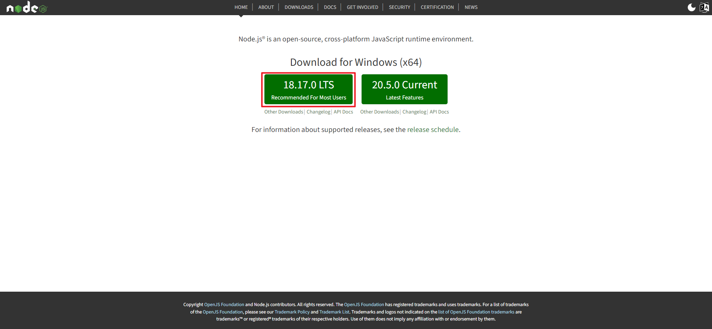
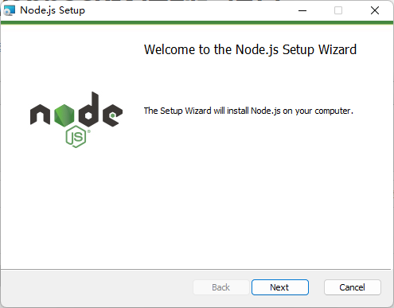
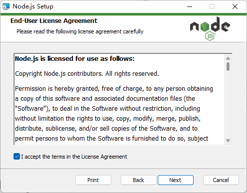
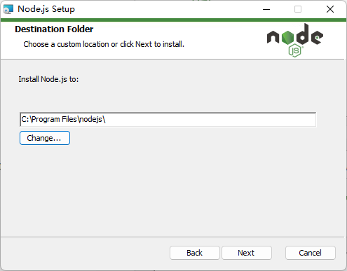
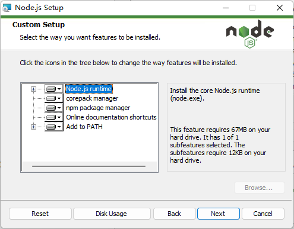
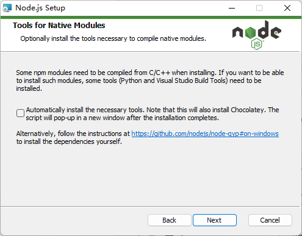
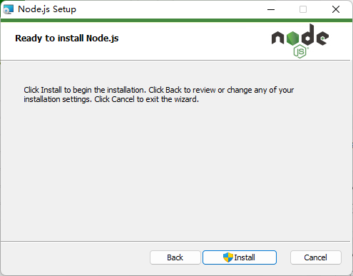

# 安装Node.js

https://nodejs.org/en

# 创建一个项目

https://cn.vuejs.org/guide/quick-start.html

https://cli.vuejs.org/zh/guide/creating-a-project.html#vue-create

使用vue cli

坑：

**npm : 无法将“npm”项识别为 cmdlet、函数、脚本文件或可运行程序的名称。请检查名称的拼写，如果包括路径，请确保路径正确，然后再试一次。**

饿美了生鲜

大家好，我是无畏，今天给大家讲一共**饿美了生鲜**

# vue + webpack搭建前端项目

https://www.jianshu.com/p/c674be93bdd6

# 全面解析vue权限管理 acl权限控制

https://www.jianshu.com/p/611e2dcf774f?utm_campaign=haruki&utm_content=note&utm_medium=reader_share&utm_source=weixin

# 扫描二维码

https://cdn.asilu.com/jsQR/