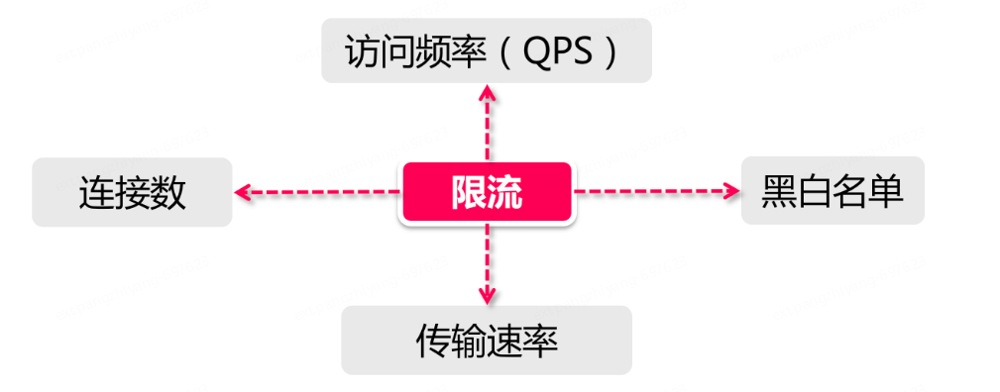
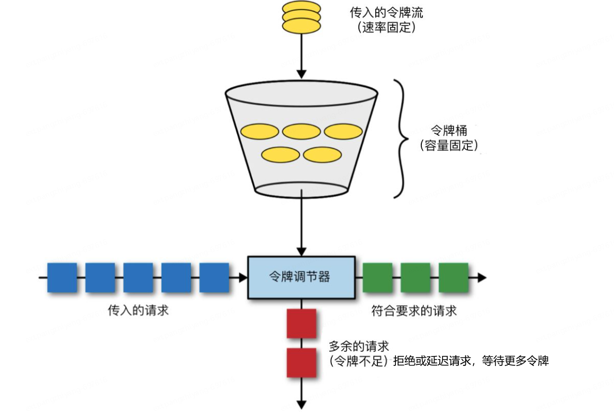
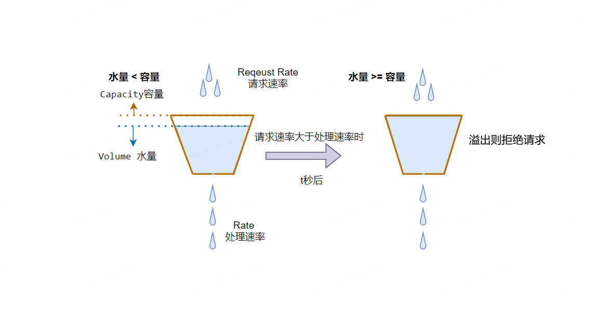

限流就是在某个时间窗口对资源访问做限制，比如设定每秒最多100个访问请求。

## **限流维度**
**时间：** 限流基于某段时间范围或者某个时间点，也就是我们常说的“时间窗口”，比如对每分钟、每秒钟的时间窗口做限定。
**资源：** 基于可用资源的限制，比如设定最大访问次数，或最高可用连接数。

 

### **QPS和连接数控制**

在真实环境中，通常会设置多个维度的限流规则，比如设定同一个IP每秒访问频率小于10，连接数小于5，再设定每台机器QPS最高1000，连接数最大保持200。
更进一步，还可以把某个服务器组或整个机房的服务器当做一个整体，设置更high-level的限流规则，这些所有限流规则都会共同作用于流量控制。

 

### **传输速率**
对于“传输速率”大家都不会陌生，比如资源的下载速度。有的网站在这方面的限流逻辑做的更细致，比如普通注册用户下载速度为100k/s，购买会员后是10M/s，这背后就是基于用户组或者用户标签的限流逻辑。

 

### **黑白名单**
黑白名单是各个大型企业应用里很常见的限流和放行手段，而且黑白名单往往是动态变化的。举个例子，如果某个IP在一段时间的访问次数过于频繁，被系统识别为机器人用户或流量攻击，那么这个IP就会被加入到黑名单，从而限制其对系统资源的访问，这就是俗称的“封IP”。

平时所看到的爬虫程序，比如说爬知乎上的美女图片，或者爬券商系统的股票分时信息，这类爬虫程序都必须实现更换IP的功能，以防被加入黑名单。有时我们还会发现公司的网络无法访问12306这类大型公共网站，这也是因为某些公司的出网IP是同一个地址，因此在访问量过高的情况下，这个IP地址就被对方系统识别，进而被添加到了黑名单。使用家庭宽带的同学们应该知道，大部分网络运营商都会将用户分配到不同出网IP段，或者时不时动态更换用户的IP地址。

白名单就更好理解了，相当于御赐金牌在身，可以自由穿梭在各种限流规则里，畅行无阻。比如某些电商公司会将超大卖家的账号加入白名单，因为这类卖家往往有自己的一套运维系统，需要对接公司的IT系统做大量的商品发布、补货等等操作。

 

### **分布式环境**
分布式区别于单机限流的场景，它把整个分布式环境中所有服务器当做一个整体来考量。比如说针对IP的限流，我们限制了1个IP每秒最多10个访问，不管来自这个IP的请求落在了哪台机器上，只要是访问了集群中的服务节点，那么都会受到限流规则的制约。

最好将限流信息保存在一个“中心化”的组件上，这样它就可以获取到集群中所有机器的访问状态，目前比较主流的限流方案：

**网关层限流：** 将限流规则应用在所有流量的入口处。

**中间件限流：** 将限流信息存储在分布式环境中某个中间件里（比如Redis缓存），每个组件都可以从这里获取到当前时刻的流量统计，从而决定是拒绝服务还是放行流量。
**组件限流：** sentinel，springcloud生态圈为微服务量身打造的一款用于分布式限流、熔断降级等组件。

 
 

## **限流方案常用算法**
### **令牌桶算法**

令牌桶算法（Token Bucket）是一种流量整形（Traffic Shaping）以及流量控制（Rate Limiting）算法。在这个算法中，系统使用一个“桶”来储存“令牌”，每个令牌代表一个特定的资源或者权限。这个桶有一个固定的容量，并且以一个固定的速度产生新的令牌。

**令牌：** 获取到令牌的Request才会被处理，其他Requests要么排队要么被直接丢弃。
**桶：** 用来装令牌的地方，所有Request都从这个桶里面获取令牌。

当一个请求到达时，系统会尝试从这个桶中获取一个令牌。如果桶中有足够的令牌，那么请求就被允许通过，并且消耗一个令牌。如果桶中没有足够的令牌，那么请求就被延迟或者拒绝，这取决于你的系统设计。

以下是一个简单的令牌桶算法的流程图：

这个算法可以用来控制各种资源的访问速度，例如网络带宽、数据库查询速度等。它是一种简单有效的流量控制方法，可以防止系统过载。

主要涉及到2个过程：令牌生成和令牌获取。

**令牌生成**
这个流程涉及到令牌生成器和令牌桶，前面提到过令牌桶是一个装令牌的地方，既然是个桶那么必然有一个容量，也就是说令牌桶所能容纳的令牌数量是一个固定的数值。

对于令牌生成器来说，它会根据一个预定的速率向桶中添加令牌，比如可以配置让它以每秒100个请求的速率发放令牌，或者每分钟50个。注意这里的发放速度是匀速，也就是说这50个令牌并非是在每个时间窗口刚开始的时候一次性发放，而是会在这个时间窗口内匀速发放。

在令牌发放器就是一个水龙头，假如在下面接水的桶子满了，那么自然这个水（令牌）就流到了外面。在令牌发放过程中也一样，令牌桶的容量是有限的，如果当前已经放满了额定容量的令牌，那么新来的令牌就会被丢弃掉。

**令牌获取**
每个访问请求到来后，必须获取到一个令牌才能执行后面的逻辑。假如令牌的数量少，而访问请求较多的情况下，一部分请求自然无法获取到令牌，这时可以设置一个“缓冲队列”来暂存这些多余的令牌。

缓冲队列其实是一个可选的选项，并不是所有应用了令牌桶算法的程序都会实现队列。当有缓存队列存在的情况下，那些暂时没有获取到令牌的请求将被放到这个队列中排队，直到新的令牌产生后，再从队列头部拿出一个请求来匹配令牌。

当队列已满的情况下，这部分访问请求将被丢弃。在实际应用中还可以给这个队列加一系列的特效，比如设置队列中请求的存活时间，或者将队列改造为PriorityQueue，根据某种优先级排序，而不是先进先出。

 

### **漏桶算法**
漏桶算法（Leaky Bucket）是流量整形或速率限制时经常使用的一种算法，主要目的是控制数据注入到网络的速率，平滑网络上的突发流量。漏桶算法思路简单，水（请求）先进入到漏桶中，漏桶以一定的速度出水（接口有响应速率），当水流速度过大直接溢出（访问频率超过接口响应频率），然后就拒绝请求。

漏桶算法能强制限制数据的传输速率，令牌桶算法则满足这些具有突发特性的流量

**漏桶vs令牌桶的区别：**
漏桶算法的前半段和令牌桶类似，但是操作的对象不同，令牌桶是将令牌放入桶里，而漏桶是将访问请求的数据包放到桶里。同样的是，如果桶满了，那么后面新来的数据包将被丢弃。

漏桶算法的后半程是有鲜明特色的，它永远只会以一个恒定的速率将数据包从桶内流出。打个比方，如果我设置了漏桶可以存放100个数据包，然后流出速度是1s一个，那么不管数据包以什么速率流入桶里，也不管桶里有多少数据包，漏桶能保证这些数据包永远以1s一个的恒定速度被处理。

根据它们各自的特点不难看出来，这两种算法都有一个“恒定”的速率和“不定”的速率。令牌桶是以恒定速率创建令牌，但是访问请求获取令牌的速率“不定”，反正有多少令牌发多少，令牌没了就干等。而漏桶是以“恒定”的速率处理请求，但是这些请求流入桶的速率是“不定”的。

从这两个特点来说，漏桶的天然特性决定了它不会发生突发流量，就算每秒1000个请求到来，那么它对后台服务输出的访问速率永远恒定。而令牌桶则不同，其特性可以“预存”一定量的令牌，因此在应对突发流量的时候可以在短时间消耗所有令牌，其突发流量处理效率会比漏桶高，但是导向后台系统的压力也会相应增多。

 

### **滑动窗口**

**概念**

限流滑动窗口算法是一种在时间序列数据中实现滑动窗口流量限制的算法。它的主要目的是在处理时间序列数据时，限制滑动窗口内的数据流量，以避免处理大量数据而导致的计算资源浪费或者性能下降。

限流滑动窗口算法的实现思路：
1. 初始化一个滑动窗口，窗口大小为W。
2. 将窗口内的第一个元素加入到限流队列中。
3. 从第二个元素开始，判断该元素是否应该加入到限流队列中。如果队列的大小已经达到了限制流量的大小，就停止加入，同时将队列头部的元素出队。如果队列的大小没有达到限制流量的大小，就将该元素加入到队列中。
4. 重复步骤3，直到处理完时间序列中的所有元素。

限流滑动窗口算法可以通过限制队列的大小来实现流量的控制。队列的大小可以根据实际需要进行设置。队列中保存的是时间序列中相邻元素的时间差，用于计算窗口内的平均流量。如果时间差大于平均流量，就停止加入元素，否则就继续加入元素。同时，为了保证窗口的滑动，还需要维护一个窗口的起始位置和结束位置，以便于在处理下一个窗口时使用。

比如说，在每一秒内有20个用户访问，第1秒内有75个用户访问,第2秒内有25个用户访问，那么在0到2秒这个时间窗口内访问量就是100,3~5秒内达到限流大小停止入队。如果接口设置了时间窗口内访问上限是100，那么当时间到第六秒时，这个时间窗口内的计数总和就变成了25，因为1秒的格子已经退出了时间窗口，因此在第六秒内可以接收的访问量就是100-25=75。

滑动窗口其实也是一种计算器算法，它有一个显著特点，当时间窗口的跨度越长时，限流效果就越平滑。打个比方，如果当前时间窗口只有两秒，而访问请求全部集中在第一秒的时候，当时间向后滑动一秒后，当前窗口的计数量将发生较大的变化，拉长时间窗口可以降低这种情况的发生概率。

 

**局限性**

滑动窗口算法在某些情况下可能会有局限性。以下是该算法的一些局限性：
1. 窗口大小的固定性：该算法中，窗口的大小是固定的（在这个例子中为3）。这使得算法在处理不同大小的窗口时可能不够灵活。如果需要处理不同大小的窗口，可能需要针对每个窗口大小重新实现算法。
2. 对输入数据的依赖性：该算法对于输入数据的特性有一定的依赖性。在某些情况下，输入数据可能并不适合使用滑动窗口算法来处理。例如，如果数据是离散的且分布不均，或者数据中存在大量的重复值，该算法的效果可能会受到影响。
3. 时间复杂度：虽然该算法的时间复杂度在大多数情况下是可接受的（O(n)，其中n是数组的长度），但在某些情况下，如果窗口大小比较大，或者数组非常大，算法的运行时间可能会变得较长。
4. 处理重叠窗口的能力：该算法只处理了非重叠的窗口，如果需要处理重叠窗口的情况，该算法需要进行修改和扩展。
总的来说，滑动窗口算法在处理某些特定问题时非常有效，但在其他情况下可能会有局限性。在选择使用该算法时，应该充分考虑其局限性，并确保它适合于所处理的问题。

 
 

## **常用的限流方案**
### **合法性验证限流**
比如验证码、IP 黑名单等，这些手段可以有效的防止恶意攻击和爬虫采集。

### **Guava限流**
在限流领域中，Guava在其多线程模块下提供了以RateLimiter为首的几个限流支持类，但是作用范围仅限于“当前”这台服务器，也就是说Guawa的限流是单机的限流，跨了机器或者jvm进程就无能为力了。

比如，有2台服务器[Server 1，Server 2]，这两台服务器都部署了一个登陆服务，假如希望对这两台机器的流量进行控制，比如将两台机器的访问量总和控制在每秒20以内，如果用Guava来做，只能独立控制每台机器的访问量<=10。

尽管Guava不是面对分布式系统的解决方案，但是其作为一个简单轻量级的客户端限流组件，非常适合来讲解限流算法。

**实例**
https://blog.csdn.net/2301_79376376/article/details/132790563

### **网关层限流**
服务网关，作为整个分布式链路中的第一道关卡，承接了所有用户来访请求，因此在网关层面进行限流是一个很好的切入点，上到下的路径依次是：

1.用户流量从网关层转发到后台服务；
2.后台服务承接流量，调用缓存获取数据；
3.缓存中无数据，则访问数据库；
流量自上而下是逐层递减的，在网关层聚集了最多最密集的用户访问请求，其次是后台服务。

然后经过后台服务的验证逻辑之后，刷掉了一部分错误请求，剩下的请求落在缓存上，如果缓存中没有数据才会请求漏斗最下方的数据库，因此数据库层面请求数量最小（相比较其他组件来说数据库往往是并发量能力最差的一环，阿里系的MySQL即便经过了大量改造，单机并发量也无法和Redis、Kafka之类的组件相比）

目前主流的网关层有以软件为代表的Nginx，还有Spring Cloud中的Gateway和Zuul这类网关层组件。

### **Nginx限流**
在系统架构中，Nginx的代理与路由转发是其作为网关层的一个很重要的功能，由于Nginx天生的轻量级和优秀的设计，让它成为众多公司的首选，Nginx从网关这一层面考虑，可以作为最前置的网关，抵挡大部分的网络流量，因此使用Nginx进行限流也是一个很好的选择，在Nginx中，也提供了常用的基于限流相关的策略配置。

Nginx提供了两种限流方法：一种是控制速率，另一种是控制并发连接数。

**控制速率**
需要使用limit_req_zone用来限制单位时间内的请求数，即速率限制，因为Nginx的限流统计是基于毫秒的，我们设置的速度是2r/s，转换一下就是500毫秒内单个IP只允许通过1个请求，从501ms开始才允许通过第2个请求。

控制速率优化版
上面的速率控制虽然很精准但是在生产环境未免太苛刻了，实际情况下我们应该控制一个IP单位总时间内的总访问次数，而不是像上面那样精确到毫秒，我们可以使用burst关键字开启此设置。

burst=4，意思是每个IP最多允许4个突发请求。

**控制并发数**
利用limit_conn_zone和limit_conn两个指令即可控制并发数。

其中，limit_conn perip 10表示限制单个IP同时最多能持有10个连接；limit_conn perserver 100表示server同时能处理并发连接的总数为100个。

注意：只有当request header被后端处理后，这个连接才进行计数。

### **中间件限流**
对于分布式环境来说，无非是需要一个类似中心节点的地方存储限流数据。比如，如果希望控制接口的访问速率为每秒100个请求，那么就需要将当前1s内已经接收到的请求的数量保存在某个地方，并且可以让集群环境中所有节点都能访问。那我们可以用什么技术来存储这个临时数据呢？

那么想必大家都能想到，必然是redis了，利用Redis过期时间特性，可以轻松设置限流的时间跨度（比如每秒10个请求，或者每10秒10个请求）。同时Redis还有一个特殊技能–脚本编程，可以将限流逻辑编写成一段脚本植入到Redis中，这样就将限流的重任从服务层完全剥离出来，同时Redis强大的并发量特性以及高可用集群架构也可以很好的支持庞大集群的限流访问。【reids + lua】

**实例**
https://blog.csdn.net/mingpingyao/article/details/129587679

### **限流组件**
除了上面介绍的几种方式以外，目前也有一些开源组件提供了类似的功能，比如Sentinel就是一个不错的选择。Sentinel是阿里出品的开源组件，并且包含在了Spring Cloud Alibaba组件库中，Sentinel提供了相当丰富的用于限流的API以及可视化管控台，可以很方便的帮助我们对限流进行治理。

 
 

## **从架构维度考虑限流设计**
在实践中，不会只使用一种限流手段，往往是几种方式互相搭配使用，让限流策略有一种层次感，达到资源的最大使用率。

在这个过程中，限流策略的设计也可以参考前面提到的漏斗模型，上宽下紧，漏斗不同部位的限流方案设计要尽量关注当前组件的高可用。

以我参与的实际项目为例，比如说我们研发了一个商品详情页的接口，通过手机淘宝导流，app端的访问请求首先会经过阿里的mtop网关，在网关层我们的限流会做的比较宽松，等到请求通过网关抵达后台的商品详情页服务之后，再利用一系列的中间件+限流组件，对服务进行更加细致的限流控制。

具体的实现限流的手段：

1. Tomcat 使用 maxThreads来实现限流。
2. Nginx的limit_req_zone和 burst来实现速率限流。
3. Nginx的limit_conn_zone和 limit_conn两个指令控制并发连接的总数。
4. 时间窗口算法借助 Redis的有序集合可以实现。
5. 漏桶算法可以使用Redis-Cell来实现。
6. 令牌算法可以解决Google的guava包来实现。

需要注意的是借助Redis实现的限流方案可用于分布式系统，而guava实现的限流只能应用于单机环境。如果你觉得服务器端限流麻烦，可以在不改任何代码的情况下直接使用容器限流（Nginx或Tomcat），但前提是能满足项目中的业务需求。

 
 

## **Tomcat限流**
Tomcat8.5 版本的最大线程数在conf/server.xml配置中，maxThreads就是Tomcat的最大线程数，当请求的并发大于此值（maxThreads）时，请求就会排队执行，这样就完成了限流的目的。

注意：

maxThreads的值可以适当的调大一些，Tomcat默认为150（Tomcat版本8.5），但这个值也不是越大越好，要看具体的服务器配置，需要注意的是每开启一个线程需要耗用1MB的JVM内存空间用于作为线程栈之用，并且线程越多GC的负担也越重。

最后需要注意一下，操作系统对于进程中的线程数有一定的限制，Windows每个进程中的线程数不允许超过2000，Linux每个进程中的线程数不允许超过1000。

 
 

> 参考：
> https://blog.csdn.net/wo541075754/article/details/129815466